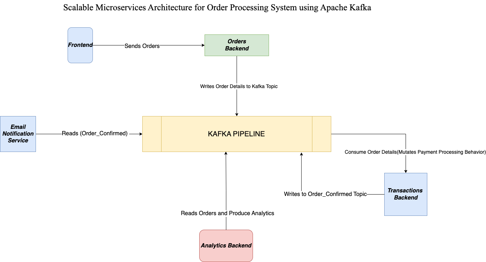

# Scalable Microservices Architecture for Order Processing System using Apache Kafka

This project demonstrates a scalable microservices-based architecture for an order processing system using Apache Kafka. Each microservice interacts by writing to and reading from Kafka topics, simulating the communication flow in a distributed system.

## Architecture Overview

 


The architecture consists of the following components:

1. **Frontend**: Sends order details to the Orders Backend.However, in this project we will simulate the generation of order.
2. **Orders Backend**: Writes order details to the `order_details` Kafka topic.
3. **Kafka Pipeline**: Acts as the central message broker between services, facilitating communication through topics.
4. **Transactions Backend**: Consumes messages from the `order_details` topic, simulates mutating payment processing behavior, and writes processed messages to the `order_confirmed` topic.
5. **Email Notification Service**: Reads messages from the `order_confirmed` topic to simulate sending email notifications.
6. **Analytics Backend**: Reads messages from the `order_details` topic to simulate producing analytics on the orders.

## Kafka Topics

- **`order_details`**: Stores raw order details from the Orders Backend.
- **`order_confirmed`**: Stores processed and confirmed order details from the Transactions Backend.

## How It Works

1. The **Orders Backend** receives order details from the Frontend and writes them to the `order_details` Kafka topic.
2. The **Transactions Backend** reads messages from the `order_details` topic, simulates payment processing behavior, and writes processed data to the `order_confirmed` Kafka topic.
3. The **Email Notification Service** reads confirmed orders from the `order_confirmed` topic and simulates sending email notifications.
4. The **Analytics Backend** reads raw orders from the `order_details` topic and simulates generating analytics data.

## Prerequisites

- Docker and Docker Compose installed.
- Python 3.9 or later with the required libraries (see `requirements.txt`).
- Apache Kafka setup using Docker Compose.

## Getting Started

1. Clone this repository:

   ```bash
   git clone "https://github.com/nomannaq/scalable-microservices-apache-kafka"
   cd scalable-microservices-apache-kafka
   ```

2. Start Kafka and Zookeeper services using Docker Compose:

   ```bash
   docker-compose up -d zookeeper kafka
   ```

3. Build and run each microservice using Docker Compose:

   ```bash
   docker-compose up --build
   ```

4. Monitor the logs of each service to see the message flow between Kafka topics:

   ```bash
   docker logs -f <service-name>
   ```

## Folder Structure

```
.
├── analytics_backend
│   ├── analytics_backend.py
├── email_notification_service
│   ├── emailconsumer.py
├── orders_backend
│   ├── orderbackend.py
├── transactions_backend
│   ├── transaction.py
├── docker-compose.yml
└── README.md
```

## Future Enhancements

- Implement actual business logic for each microservice instead of only reading/writing to Kafka topics.
- Add a proper frontend for user interaction.
- Introduce a database for persistent storage.
- Deploy the microservices to a Kubernetes cluster for improved scalability and orchestration.
